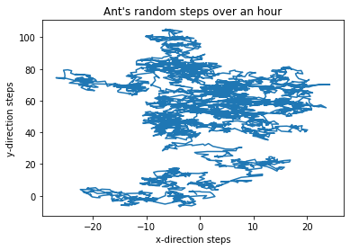
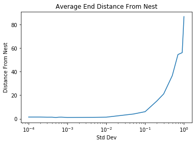
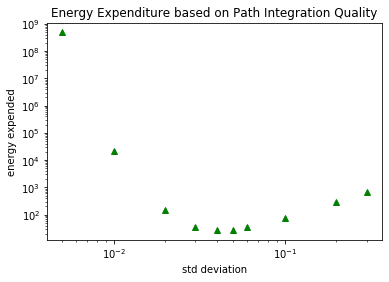

CogSci 131 HW3 

Problem 1a


```python
import numpy as np
import matplotlib.pyplot as plt

secs = 60
mins = 60
steps = secs*mins
mean = 0
std_dev = 1
x = np.random.normal(mean, std_dev, steps)
y = np.random.normal(mean, std_dev, steps)

x_axis = np.cumsum(x)
y_axis = np.cumsum(y)

plt.plot(x_axis,y_axis)
plt.ylabel('y-direction steps')
plt.xlabel('x-direction steps')
plt.title("Ant's random steps over an hour")
plt.show()
```





Problem 1b


```python
#probability is (# trials that ant makes it w/in 5mm w/in an hour)/(total # trials)
from scipy import spatial

secs = 60
mins = 120
steps = secs*mins
mean = 0
std_dev = 1
#num_trials = 500
made_it_home = 0
num_trials = 1000
for n in range(num_trials):
    x = np.random.normal(mean, std_dev, steps)
    y = np.random.normal(mean, std_dev, steps)
    x = np.cumsum(x)
    y = np.cumsum(y)
    
    #[x for i in x if x.where(i <= 3599)]
    walk_to_food_x = x[0:3599]
    walk_to_food_y = y[0:3599]
    walk_to_home_x = x[3600:7199]
    walk_to_home_y = y[3600:7199]
    
    home = [walk_to_food_x[0],walk_to_food_y[0]]
    curr_loc = 0
    while curr_loc < 3599:
        #distance between nest and current location
        distance = spatial.distance.euclidean(home, [walk_to_home_x[curr_loc], walk_to_home_y[curr_loc]])
        if distance <= 5:
            made_it_home += 1
            break
        curr_loc += 1         

probability = (made_it_home/num_trials)*100
print("The ant has a ",probability, "% chance of making it within 5 mm of the nest if it takes random steps back in 1000 trials.")             
```

    The ant has a  16.3 % chance of making it within 5 mm of the nest if it takes random steps back in 1000 trials.


I decided to run 1000 trials to test for these statistics because that seems like an appropriate amount to rule out chance and other potentially impactful factors that are not directly related to what needs to be studied. Based on the results for 1000 trials shows that only about 16% of ants found their way back to within 5 mm of their nest if they take random steps back. This isn't a very high percentage, so clearly this manner of "wandering" back to the nest randomly is not effective. Which is why there is path integration!

Problem 1c


```python
secs = 60
mins = 120
steps = secs*mins
mean = 0
std_dev = 1
num_trials = 500
made_it_home = 0
all_distance = 0
for n in range(num_trials):
    x = np.random.normal(mean, std_dev, steps)
    y = np.random.normal(mean, std_dev, steps)
    x = np.cumsum(x)
    y = np.cumsum(y)
    
    #[x for i in x if x.where(i <= 3599)]
    walk_to_food_x = x[0:3599]
    walk_to_food_y = y[0:3599]
    walk_to_home_x = x[3600:7199]
    walk_to_home_y = y[3600:7199]
    
    home = [walk_to_food_x[0],walk_to_food_y[0]]
    curr_loc = 0
    distance = []
    while curr_loc < 3599:
        #distance between nest and current location
        distance.append(spatial.distance.euclidean(home, [walk_to_home_x[curr_loc], walk_to_home_y[curr_loc]]))
        curr_loc += 1
    all_distance += min(distance)
avg_min_distance = all_distance/num_trials
print(avg_min_distance)
```

    44.74469949477085


On average, the closest an ant gets back to its nest after random wandering is 44.745 mm.

Problem 2


```python
secs = 60
mins = 60
steps = secs*mins #3600
mean = 0
norm_std_dev = 1
    

def all_trials(mean,std_dev,num_trials,steps):
    sum_ = 0
    for t in range(num_trials):
        x = np.random.normal(mean, 1, steps)
        y = np.random.normal(mean, 1, steps)

        #create noisiness, add to actual vector
        x_noisy = x + np.random.normal(mean, std_dev, steps)
        y_noisy = y + np.random.normal(mean, std_dev, steps)

        x = np.cumsum(x)
        y = np.cumsum(y)
        x_noisy = np.cumsum(x_noisy)
        y_noisy = np.cumsum(y_noisy)   

        perceived_vector_back = [(x[3599] - x_noisy[3599]), (y[3599]-y_noisy[3599])]
        nest = [x[0], y[0]]
        distance = spatial.distance.euclidean(nest, perceived_vector_back)
        
        sum_ += distance
        
        
    avg = round((sum_/num_trials), 2)
    
    return avg
        
        
std_dev_kinds = [1, .9, .7, .5, .3, .2, .1, .05, .01, .005, .001, .0007, .0006, .0005, .0004, .0003, .0002, .0001]
avg_distance = []

for s in std_dev_kinds:
    t = all_trials(mean,s,20,steps)
    avg_distance.append(t)
    
plt.plot(std_dev_kinds, avg_distance)
plt.xscale("log")
plt.title("Average End Distance From Nest")
plt.xlabel("Std Dev")
plt.ylabel("Distance From Nest")
```


    Text(0, 0.5, 'Distance From Nest')





Problem 3a


```python
sec = 60
mins = 120
steps = sec*mins
mean = 0
norm_std_dev = 1

def energy_times(mean,steps,num_trials,std_dev):
    sum_ = 0
    for i in range(num_trials):
        sum_ += expend_energy(mean,steps,std_dev)
    avg_en = sum_/num_trials
    return avg_en

def expend_energy(mean,steps,std_dev):
    sum_ = 0
    for t in range(num_trials):
        x = np.random.normal(mean, 1, steps)
        y = np.random.normal(mean, 1, steps)

        #create noisiness, add to actual vector
        x_noisy = x + np.random.normal(mean, std_dev, steps)
        y_noisy = y + np.random.normal(mean, std_dev, steps)

        x = np.cumsum(x)
        y = np.cumsum(y)
        x_noisy = np.cumsum(x_noisy)
        y_noisy = np.cumsum(y_noisy)   

        vector_back = [(x[3599] - x_noisy[3599]), (y[3599]-y_noisy[3599])]
        nest = [x[0], y[0]]
        distance = spatial.distance.euclidean(nest, vector_back)
        energy = (np.exp(.1/std_dev)) + (distance**2)
        return energy
std_dev_kinds = [.3, .2, .1, .06, .05, .04, .03, .02, .01, .005]
energy_avg = []

for s in std_dev_kinds:
    energy = energy_times(mean,steps,500,s)
    energy_avg.append(energy)
    #print(np.log(energy_avg))
    
plt.plot(std_dev_kinds, energy_avg, 'g^')
plt.yscale("log")
plt.xscale("log")
plt.ylabel('energy expended')
plt.xlabel('std deviation')
plt.title('Energy Expenditure based on Path Integration Quality')
```


    Text(0.5, 1.0, 'Energy Expenditure based on Path Integration Quality')





Problem 3b

The graph above represents the amount of energy used by an ant with respect to their ability to path integrate, for a number of standard deviation values. The amount of energy used is important because it shows us the "fitness" of an ant; if it uses a lot of energy it won't have much for other activities/necessities, and if it doesn't use a lot it will have more energy and be able to survive for longer potentially. The minimum on the graph is the minimum amount of energy an ant needs to use to path integrate and return home. The values on either side of this minimum represent an ant's difficulty creating a good path integration and following it effectively. The minimum on this graph is most ideal for least energy expended while searching for food and returning to the nest.


```python

```
